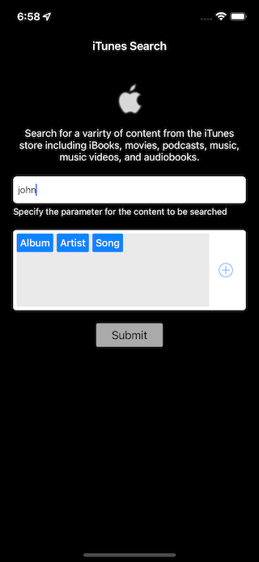
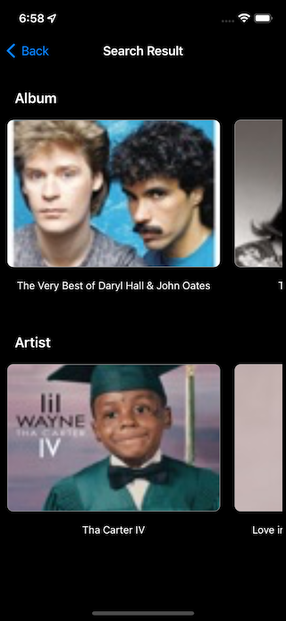

# iTunesSearchApp
iOS Application using viper architecture pattern

Searching using iTunes search API
1. Async Await API 
2. Protocol 

#### App Screenshots

<table>
  <tr>
    <td align ="center"> Home</td>
    <td align ="center"> Media Type </td>
    <td align ="center"> Details</td>
  </tr>
  <tr>
    <td></td>
    <td></td> 
    <td></td>
  </tr>
 </table>
